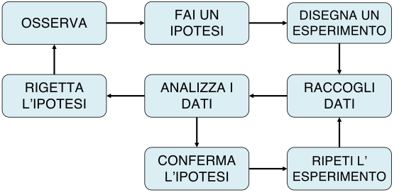
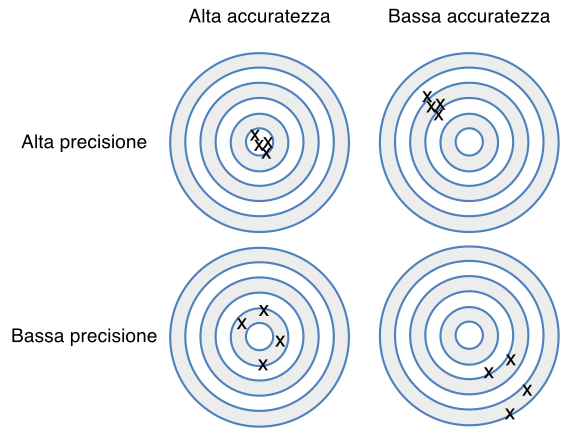

# Scienza, dati ed esperimenti

*A witty saying proves nothing (Voltaire)*

In una società caratterizzata dal sovraccarico cognitivo, è chiedersi (e chiedere) che cosa sia la scienza, cioè cosa distingua le informazioni scientifiche da tutto quello che invece non è altro che pura opinione, magari autorevole, ma senza il sigillo dell'oggettività.

Per quanto affascinante possa sembrare l'idea del ricercatore che con un'improvviso colpo di genio elabora una stupefacente teoria, dovrebbe essere chiaro che l'intuizione, per quanto geniale ed innovativa, è solo un possibile punto di partenza, che non necessariamente prelude al progresso scientifico. In generale, almeno in ambito biologico, nessuna teoria acquisisce automaticamente valenza scientifica, ma rimane solo nell'ambito delle opinioni, indipendentemente dal fatto che nasca da un colpo di genio, oppure da un paziente e meticoloso lavoro di analisi intellettuale, che magari si concretizza in un modello matematico altamente elegante e complesso.

Che cosa è che permette ad una prova scientifica di uscire dall'ambito delle opinioni legate a divergenze di cultura, percezione e/o credenze individuali, per divenire, al contrario, oggettiva e universalmente valida? Che cosa è che distingue la verità scientifica da altre verità di natura metafisica, religiosa o pseudoscientifica?

Il metodo attraverso il quale vengono prodotte prove scientifiche (metodo scientifico, appunto) viene comunemente fatto risalire a Galileo Galilei (1564-1642) e può essere riassunto in una sequenza di 'azioni' (Fig. [-@fig-figName11]).

```{r fig-figName11, echo=FALSE, out.width = "75%", fig.cap = "Il metodo scientifico Galileiano", fig.align='center'}
# Needs brew install poppler in terminal
fignam <- "MSAMap_ita.pdf"
url <- paste("https://www.casaonofri.it/_Figures/", fignam, sep = "")
dest <- paste("_images/", fignam, sep = "")
download.file(url, dest, mode = "wb")
system("pdftocairo -svg _images/MSAMap_ita.pdf _images/MSAMap_ita.svg")
# knitr::include_graphics(paste("_images/", fignam, sep = ""))

```

Due sono gli aspetti da notare:

1.  il ruolo fondamentale dell'esperimento scientifico, che produce dati a supporto di ipotesi pre-esistenti;
2.  lo sviluppo di teorie basate sui dati, che rimangono valide fino a che non si raccolgono altri dati che le confutano, facendo nascere nuove ipotesi che possono portare allo sviluppo di nuove teorie, più affidabili o più semplici.

## Dati, errori e verità

Il fatto che non possa esistere prova scientifica senza dati dovrebbe essere già chiaro a tutti; un famoso aforisma recita: "In God we trust, all the others bring data", ed è attribuito all'ingegnere e statistico americano W. Edwards Deming (1900-1993), anche se pare che egli, in realtà, non l'abbia mai pronunciato @hastie_2009. Quello che viene, talvolt, dimenticato è che non basta avere dati, bisogna anche che i dati siano 'buoni', cioè che siano in grado di cogliere gli effetti che vogliamo studiare, senza introdurre distorsioni di sorta.

Purtroppo i dati possono essere di cattiva qualità; ad esempio, potrebbero indicare che una pianta è alta 1,85 m quando in realtà non lo è, oppure potrebbero suggerire che un seme è dormiente quando in realtà è morto. La produzione di dati sbagliati può essere dovuta, ad esempio, alle metodiche impiegate per misurare, contare o registrare i fenomeni, che non sono adeguate agli scopi del lavoro, il che è costituisce un problema relativamente frequente nelle scienze sociali, dove può impattare in modo anche 'drammatico' sulle decisioni politiche o economiche @sturge_2022. Furtunatamente, la ricerca agraria o, in genere, biologica, il più delle volte (ma non sempre...) impiega metodi d'indagine rigorosi e ben definiti da appositi protocolli, sui quali vi è stato largo consenso nella comunità scientifica. Sfortunatamente, però, i ricercatori devono comunque gestire il cosiddetto **errore sperimentale**, una componente intrinseca ed inevitabile di ogni esperimento sul campo. La parola "errore", non deve trarre in inganno: non significa necessariamente che qualcuno stia facendo o abbia fatto qualcosa di sbagliato; al contrario, l'errore sperimentale si genera nonostante l'applicazione di un protocollo di ricerca rigoroso e corretto, senza alcuna negligenza da parte di chichessia.

Ci sono tre fondamentali fonti di errore sperimentale:

1.  Errori di misura
2.  Errori di campionamento

Gli errori di misura sono legati allo strumento e dipendono dall'errata taratura, dall'impiego di un protocollo sbagliato, da inesattezze strumentali, da errori nella trascrizione dei risultati oppure dall'irregolarità dell'oggetto da misurare. Ad esempio, pensate alla misurazione dell'altezza di una pianta di mais: è facile riscontrare difficoltà legate, ad esempio, all'individuazione del punto esatto in cui inizia il culmo e del punto esatto dove termina l'infiorescenza apicale.

Oltre agli errori di misurazione a livello del singolo "oggetto", esistono altre fonti di incertezza, meno evidenti, legate al fatto che, il più delle volte, non studiamo un singolo oggetto (ad esempio, una pianta) ma un gruppo di oggetti (ad esempio, una coltura) e, pertanto, dobbiamo effettuare misurazioni multiple.

A parte gli errori di misura a livello di singolo 'oggetto', ci sono anche altre sorgenti di errore meno evidenti e legate al fatto che, nel lavoro sperimentale, non studiamo un singolo soggetto, ma un gruppo più o meno numeroso. Ad esempio, se dobbiamo misurare l'effetto di un erbicida, non possiamo farlo trattando una sola pianta, ma dobbiamo ripetere le misure su un gruppo di piante; anche se riuscissimo ad evitare tutti gli errori per ogni singola misurazione (il che è pressoché impossibile), dovremmo comunque fare i conti con un certo grado di variabilità inter-individuale e, di conseguenza, dovremmo utilizzare una statistica, come la media, per riassumere i risultati. Quando il gruppo in esame è troppo numeroso per misurare tutti gli individui, siamo obbligati a considerare un piccolo campione rappresentativo, e non possiamo mai essere certi che tale campione corrisponda pienamente alle caratteristiche dell'intera popolazione (ad esempio, la media del campione non coincide con la media della popolazione in esame). Cosa sarebbe successo se avessimo selezionato un campione diverso? Il fatto che partendo dalla stessa popolazione si ottengano campioni diversi e, quindi, risultati diversi costituisce l'ìerrore di campionamento, che è inevitabile e rappresenta una componente intrinseca della maggior parte dei dati di ricerca in agricoltura e biologia.

Gli errori sperimentali influiscono sulla qualità dei dati, in particolare sulla loro **precisione** e **accuratezza** (Fig. [-@fig-figName12]). I dati sono precisi quando presentano lievi variazioni tra misurazioni ripetute. Allo stesso tempo, sono accurati quando sono vicini al valore "vero". Da queste definizioni, ne consegue che la precisione è importante, ma l'accuratezza è fondamentale: dati imprecisi (dati distorti) possono portare a conclusioni errate.

```{r fig-figName12, echo=FALSE, out.width = "75%", fig.cap = "Differenza tra accuratezza e precisione", fig.align='center'}
# Needs brew install poppler in terminal
fignam <- "PrecisioneAccuratezza.pdf"
url <- paste("https://www.casaonofri.it/_Figures/", fignam, sep = "")
dest <- paste("_images/", fignam, sep = "")
download.file(url, dest, mode = "wb")
system("pdftocairo -svg _images/PrecisioneAccuratezza.pdf _images/PrecisioneAccuratezza.svg")
# knitr::include_graphics(paste("_images/", fignam, sep = ""))

```

Per comprendere in che misura gli errori sperimentali possano influire sulla precisione e sull'accuratezza, è utile distinguere tra errori **sistematici** ed **accidentali (casuali)**. L'errore sistematico è provocato da difetti intrinseci dello strumento o incapacità peculiari dell'operatore e tende a ripetersi costantemente e con lo stesso segno in misure successive. Un esempio tipico è quello di una bilancia non tarata, che tende ad aggiungere 20 grammi ad ogni misura che effettuiamo. Oltre agli strumenti non tarati, altre tipiche sorgenti di errori sistematici possono includere protocolli di misura sbagliati, metodi di campionamento inconsistenti o, comunque, ogni elemento esterno che agisca ripetutamente e costantemente in ogni processo di misura. D'altra parte, l'errore accidentale, essendo di natura casuale, tende a ripresentarsi con valori e segni diversi. Di conseguenza, è ragionevole pensare che le repliche, nel lungo periodo, producano sovrastime e sottostime con uguale probabilità, in modo che la media tende a coincidere con il valore vero. Di conseguenza, mentre l'errore sistematico impatta anche sull'accuratezza, l'errore casuale impatta prevalentemente sulla precisione.

Torniamo quindi alla nostra domanda iniziale: come facciamo ad essere sicuri che i dati siano validi ed affidabili? La risposta è semplice: non possiamo mai essere sicuri, in quanto alcuni tipi di errore (ad esempio, gli errori di campionamento) sono inevitabili e possono persino verificarsi senza essere rilevati. Di conseguenza, il progresso scientifico richiede l'adozione dei **metodi più rigorosi ed affidabili possibile, così da minimizzare la possibilità di ottenere errori sistematici**. Inoltre, è anche necessario **adottare un processo iterativo di rivalutazione e conferma**, attraverso il quale le buone teorie possano affermarsi, mentre quelle errate vengano, più o meno rapidamente, abbandonate.

In altre parole, dati 'buoni' sono conseguenza di metodi 'buoni' e, pertanto **una prova scientifica è tale non perché siamo certi che corrisponda alla realtà, ma perché siamo ragionevolmente certi che sia stata ottenuta con metodi validi!**.

## Il disegno degli esperimenti

I dati vengono raccolti attraverso un esperimento scientifico (Fig. [-@fig-figName11]), in cui si osservano le risposte di vari "soggetti" (ad esempio, piante, appezzamenti, campi) ad una serie di 'stimoli' sperimentali. Gli elementi che concorrono a definire se un esperimento è valido sono:

1.  l'ipotesi,
2.  i trattamenti sperimentali,
3.  le unità sperimentali,
4.  il processo di allocazione dei trattamenti alle unità sperimentali, e
5.  la/le variabile/i di risposta.

### L' ipotesi scientifica

Trascurando la ricerca bibliografica, che è pur fondamentale, nel metodo scientifico galileiano, il punto di partenza di un esperimento è l'**ipotesi scientifica**, dalla quale discende tutto il lavoro successivo. Questa ipotesi deve essere rilevante, chiaramente definita e specifica; insomma, dobbiamo aver individuato con chiarezza una connessione tra eventi che potrebbe essere spiegata da una relazione causa-effetto. Un ipotesi, solitamente si pone in forma dubitativa: "*la germinazione di un lotto di semi potrebbe dipendere dall'adozione di un certo metodo di priming*"; oppure: "*la produttività di una coltura potrebbe migliorare con l'adozione di una maggiore fittezza d'impianto*".

Dall'ipotesi, in modo consequenziale scaturiscono gli obiettivi della ricerca, cioè le domande alle quali la ricerca intende dare risposta. Questi obiettivi dovranno essere raggiungibili/realistici e temporalmente organizzati; inoltre, dovrà essere possibile capire se e quando siano stati raggiunti attraverso un qualche indicatore misurabile.

Il rischio che si corre con obiettivi mal posti è quello di eseguire una ricerca dispersiva, con raccolta di dati non necessari e/o mancanza di dati fondamentali, con costi più elevati del necessario e un uso poco efficiente delle risorse. In genere, prima si definisce un obiettivo generale, poi si definiscono uno o più obiettivi specifici, proiettati su un più breve spazio temporale, anche per marcare le fasi necessarie per raggiungere l'obiettivo generale.

Non è un caso se, in un lavoro scientifico, gli obiettivi della ricerca sono posti in fondo all'introduzione, appena prima dell'esposizione dei materiali e metodi.

La definizione di un'ipotesi di ricerca, viene molto spesso influenzata dal **principio di falsificazione** di Karl Popper (1902-1994), che sosteneva che non fosse mai possibile dimostrare che una teoria è vera, in quanto non è possibile escludere la raccolta futura di dati che la smentiscano. Un famoso esempio cita come sia impossibile dimostrare un semplice assunto, quale: "tutti i cigni sono bianchi", poiché sarebbe necessario osservare tutti i cigni, il che è, appunto, impossibile. Al contrario, è invece possibile dimostrare la falsità dell'affermazione precedente, semplicemente osservando un cigno che non sia bianco.

Ancor prima di Popper, Ronald Fisher aveva sottolineato come la ricerca scientifica potesse solo potare a confutare una teoria, e, pertanto, aveva suggerito di porre le ipotesi di ricerca in una forma che potesse essere confutata. Ad esempio, volendo dimostrare che i due genotipi A e B sono diversamente produttivi, è più conveniente porre l'ipotesi di ricerca nella forma 'i due genotipi A e B sono uguali' ('ipotesi nulla' come la chiamò Fisher), in modo da poterla confutare con un singolo esperimento i cui risultati siano ad essa contrari. Su questa linea di pensiero, Fisher fornì una regola euristica per decidere quando l'ipotesi nulla può essere rifiutata ed una statistica per misurare la forza dell'evidenza contro l'ipotesi nulla (vedi Capitolo 7); pochi anni dopo, Jerzy Neyman (1894-1981) ed Egon Pearson (1895-1980) proposero l'adozione di un'ipotesi alternativa, da assumere come vera, ogni qual volta che l'ipotesi nulla sia rigettata. Nel nostro esempio, l'ipotesi alternativa sarebbe appunto che le rese di A e B sono diverse e, se l'esperimento fornisce evidenza che l'ipotesi nulla è falsa, essa viene adottata e considerata vera finché un altro esperimento non la falsifichi.

Sebbene alcuni dei concetti sopra esposti siano stati oggetto di un acceso dibattito [vedi, ad esempio @quinn_2002], l'idea che il ruolo degli esperimenti sia quello di rifiutare le ipotesi è fondamentale e costituisce la base teorica del test d'ipotesi classico (vedi il Capitolo 7).

### I trattamenti sperimentali

Dopo aver definito l'obiettivo di un esperimento, pertanto, è necessario chiarire esattamente quali saranno gli stimoli ai quali sottoporremo le unità sperimentali. Uno 'stimolo' sperimentale prende il nome di **fattore sperimentale**, che può avere più **livelli**, detti **trattamenti (o tesi) sperimentali**. Ad esempio, se l'obiettivo è quello di valutare l'effetto della temperatura sulla germinazione dei semi di quinoa, il fattore sperimentale sarà la temperatura, con tre livelli, 10, 15 e 25°C, ai quali verranno sottoposte le capsule Petri incluse in prova. Nel caso in cui abbiamo un esperimento con un fattore sperimentale ed un solo livello, parliamo di *esperimento misurativo*, mentre, se i livelli sono più di uno, allora parliamo di *esperimento comparativo*, che costituisce la situazione più comune nella ricerca agraria.

Talvolta gli obiettivi dell'esperimento comportano lo studio di più di un fattore sperimentale; ad esempio, oltre che alla temperatura, potremmo anche essere interessati a studiare l'effetto dell'umidità sulla germinazione dei semi. In questo caso potremmo pianificare due esperimenti separati oppure un unico esperimento, in cui prendiamo in considerazione entrambi i fattori sperimentali. Un esperimento con più fattori sperimentali si dice **fattoriale**, o meglio, **multi-fattoriale** ed i fattori possono essere **incrociati (crossed)** oppure **innestati (nested)**. Nel primo caso includeremo in prova tutte le possibili combinazioni tra i livelli di ogni fattore. Ad esempio, se volessimo studiare il comportamento di tre varietà di girasole (A, B e C) con due tipi di concimi (pollino e urea), potremmo disegnare un esperimento con 6 trattamenti, rappresentati da tutte le possibili combinazioni di varietà e concimi, cioè A-pollina, A-urea, B-pollina, B-urea, C-pollina e C-urea.

In un disegno a fattori innestati, invece, i livelli di un fattore cambiano al cambiare dei livelli dell'altro. Ad esempio, se volessimo confrontare l'adattabilità di frumento ed orzo in un sistema biologico e volessimo esprimere un giudizio generalee non ristretto ad una singola varietà per specie, dovremmo includere in prova, per ogni specie, molte varietà. In questo caso, il fattore sperimentale 'varietà' avrebbe livelli diversi per ogni specie ed il disegno sperimentale sarebbe, pertanto, innestato e non incrociato.

In alcuni casi è necessario inserire in prova un trattamento che funga da riferimento per tutti gli altri; questo trattamento è comunemente detto **testimone**[^01-introbiometria-1]. Possiamo avere:

[^01-introbiometria-1]: Il "testimone" viene spesso chiamato "controllo", ma in questo libro cercheremo di evitare l'uso di questo termine, per evitare ogni possibile confusione con il "controllo degli errori", che è un concetto diverso e sarà discusso nella sezione 1.4.1.

1.  testimone non trattato
2.  testimone trattato con placebo
3.  testimone trattato secondo le modalità usuali

Ad esempio, in un esperimento di confronto varietale, viene usualmente incluso un genotipo di riferimento, ampiamente coltivato in tutte le aziende agricole della zona di studio. Per gli esperimenti con erbicidi, includiamo invece testimone non trattato, utilizzato per valutare la composizione della flora infestante e quantificare l'efficacia di tutti gli erbicidi in prova. Inoltre, possiamo anche includere un testimone 'weed-free' (di solito scerbato manualmente) come riferimento per valutare i possibili sintomi di fitotossicità degli erbicidi sulla coltura. In tossicologia, il testimone non trattato può essere sostituito da un testimone trattato con un placebo, ovvero un composto contenente gli stessi componenti del trattamento sperimentale ad eccezione del principio attivo. Il placebo è solitamente necessario quando:

1.  il soggetto, di solito un soggetto umano, è cosciente e può mostrare una reazione conseguente alla sua aspettativa sull'effetto del trattamento;
2.  la formulazione contiene, oltre al principio attivo, altre sostanze come 'surfattanti, co-adiuvanti, che siano caratterizzati da efficiacia biologica verso l'organismo in studio.

### Le unità sperimentali

L'unità sperimentale è l'entità fisica che riceve il trattamento sperimentale; può essere una pianta, un animale, un vaso, una capsula Petri o ogni altra entità di rilievo per lo studio in atto. Le unità sperimentali non vanno confuse con le **unità osservazionali**, perché le due entità non sempre coincidono. Ad esempio, noi potremmo allocare il trattamento erbicida ad un vaso e poi misurare l'altezza delle singole piante trattate; in questo caso il vaso è l'unità sperimentale (perché ha subito il trattamento), mentre la pianta è l'unità osservazionale. Avere chiara questa differenza è fondamentale per evitare problemi di pseudo-replicazione, come abbiamo dettagliato nel capitolo precedente.

Le unità sperimentali sono sempre selezionate da una popolazione più grande, detta **cornice di campionamento**; ad esempio, noi selezioniamo le parcelle da un campo, gli animali da una mandria e le piante da una coltura. Comunque sia, il campione selezionato deve essere omogeneo e rappresentativo, anche se i due concetti sono spesso discordanti. Infatti, se selezioniamo soggetti molto omogenei, potremmo ottenere un campione che non rappresenta più tutte le caratteristiche della cornice di campionamento. Ad esempio, se selezioniamo solo individui maschi in buona salute, il campione non necessariamente rappresenta l'intera popolazione, se composta anche da femmine e da soggetti con patologie in atto.

Campionare una popolazione d'interesse non è un procedimento banale, specie nelle scienze sociali, laddove è stato necessario definire diversi protocolli di campionamento (casuale, sistematico, stratificato, a quota ...), per i quali si rimanda ai testi specializzati (ad esempio, @daniel_2011). In questo libro noi facciamo riferimento soprattutto alle prove di pieno campo e di laboratorio. Per le prime, la selezione delle unità sperimentali corrisponde fondamentalmente con la selezione dell'appezzamento di prova e l'identificazione delle parcelle, di cui parleremo tra poco.

Per le prove di laboratorio, invece, la situazione può essere abbastanza diversa, in quanto le unità sperimentali sono specificatamente create per un certo esperimento (vasetti, capsule Petri ad altri preparati). Di conseguenza, non vi è un vero e proprio processo di selezione, il che, tuttavia, non significa che non ci sia campionamento. Infatti, anche le unità sperimentali preparate in laboratorio debbono comunque essere considerate come campionate da un universo più grande, costituito da tutte le altre unità sperimentali che avremmo potuto preparare.

### L'allocazione dei trattamenti

L'allocazione dei trattamenti alle unità sperimentali viene in genere effettuata tramite un processo di manipolazione, come la semina di genotipi diversi, la distribuzione di erbicidi o l'utilizzo di diverse densità di semina in parcelle diverse (**esperimenti manipolativi**). Talvolta può essere opportuno nascondere dettagli specifici del processo di allocazione dei trattamenti, ad esempio quando ciò potrebbe indurre effetti inconsci, nelle unità sperimentali che li ricevono, o nei ricercatori che debbono valutarne l'effetto. In questo caso, parliamo di esperimento **cieco**, quando i soggetti non sono coscienti del trattamento che ricevono o **doppio cieco**, quando neanche i ricercatori lo sono. Non conoscere i dettagli del trattamento può anche essere necessario nelle scienze agrarie, quando debbono essere effettuati, ad esempio, dei rilievi visivi o sensoriali, in genere.

In alcuni casi, la manipolazione dei soggetti per l'allocazione del trattamento potrebbe risultare, scomoda, impossibile, oppure contraria all'etica scientifica; in questi casi, sarà necessario utilizzare unità sperimentali già 'naturalmente' trattate (**studio osservazionale**, vedi @mann_2003). Ad esempio, se vogliamo valutare l'efficacia delle cinture di sicurezza, sarebbe illegale progettare un esperimento in cui le persone vengono mandate in giro con o senza cinture allacciate; ciò che possiamo fare, in questo caso, è registrare retrospettivamente l'esito di incidenti già avvenuti in precedenza. In questo libro parleremo esclusivamente di esperimenti parcellari, che sono, per loro natura, manipolativi, senza per questo negare l'importanza degli esperimenti osservazionali in parecchie discipline scientifiche, come le scienze sociali e la medicina. Tuttavia, è bene segnalare che, nonostante la loro importanza, si ritiene che, per la maggior difficoltà nel controllo degli errori, gli esperimenti osservazionali forniscano evidenze scientifiche di più bassa qualità, rispetto agli esperimenti manipolativi [@burns_2011].

### Le variabili sperimentali

Per ogni singolo carattere, l'insieme delle modalità/valori che ognuno dei soggetti presenta prende il nome di **variabile** (proprio perché varia, cioè assume diversi valori, a seconda del soggetto). In questo senso è necessario precisare che non è corretto utilizzare il termine parametri, in quanto in statistica i parametri sono entità che rimangono costanti all'interno di una popolazione di soggetti. Ne parleremo meglio nei prossimi capitoli.

Fondamentalmente, esistono tre grandi gruppi di variabili: quelle che definiscono lo 'stimolo' sperimentale, quelle che misurano la risposta dei soggetti trattati e le eventuali variabili accessorie. Le variabili che definiscono uno 'stimolo' sperimentale sono anche dette variabili 'indipendenti' in quanto non dipendono da nessun altro elemento interno all'esperimento, a parte la volontà dello sperimentatore. Di queste variabili abbiamo già parlato, in quanto esse sono definite all'inizio dell'esperimento e rappresentano i livelli del/dei trattamento/i sperimentali, ad esempio, le modalità di lavorazione del suolo (aratura, minima lavorazione, semina su sodo) o il valore di azoto apportato (0, 50, 100, 150 kg N ha^-1^).

Durante e al termine dell'esperimento vengono invece rilevate le variabili 'risposta' che esprimono l'effetto dei trattamenti sperimentali, come, ad esempio, la produzione della coltura, il peso delle piante trattate con un diserbante, la quantità di azoto lisciviato dopo la fertilizzazione. Queste variabili vengono normalmente definite 'dipendenti', in quanto i valori assunti da ogni unità sperimentale dipendono, normalmente' dallo stimolo che hanno ricevuto.

Le variabili accessorie (o covariate) sono rilevate per misurare potenziali effetti confondenti; ad esempio, supponiamo di voler studiare la resa di alcuni alberi in base al metodo di fertilizzazione utilizzato. In tal caso, l'età dell'albero può agire come fattore confondente e, pertanto, potremmo decidere di registrarla, come variabile accessoria da utilizzare come covariata durante l'analisi dei dati.

Sia le variabili indipendenti che quelle dipendenti possono essere di quattro tipi:

1.  nominali (categoriche);
2.  ordinali;
3.  quantitative discrete;
4.  quantitative continue.

Le **variabili nominali** esprimono, per ciascun soggetto, l'appartenenza ad una determinata categoria o raggruppamento ed il valore che assumono lo definiamo modalità. L'unica caratteristica delle modalità è l'esclusività, cioè un soggetto che ha una certa modalità non può averne nessun altra. Le variabili nominali sono, ad esempio, il sesso, la varietà, il tipo di diserbante impiegato, la lavorazione e così via. Le variabili categoriche permettono di raggruppare i soggetti, ma non possono essere utilizzate per fare calcoli, se non per definire le frequenze dei soggetti in ciascun gruppo.

Anche le **variabili ordinali** esprimono, per ciascun soggetto, l'appartenenza ad una determinata categoria o raggruppamento. Tuttavia, le diverse categorie sono caratterizzate, oltre che dall'esclusività, anche da una relazione di ordine, nel senso che è possibile stabilire una naturale graduatoria tra esse. Ad esempio, la risposta degli agricoltori a domande relative alla loro percezione sull'utilità di una pratica agronomica può essere espressa utilizzando una scala con sei categorie (0, 1, 2, 3, 4 e 5), in ordine crescente da 0 a 5 (scala Likert). Di conseguenza possiamo confrontare categorie diverse ed esprimere un giudizio di ordine (2 è maggiore di 1, 3 è minore di 5), ma non possiamo eseguire operazioni matematiche, tipo sottrarre dalla categoria 3 la categoria 2 e così via, dato che la distanza tra le categorie non è specificata e, soprattutto, non è necessariamente la stessa.

Le variabili nominali e ordinali sono spesso indicate (ad esempio, nel software R) rispettivamente come "factors" e "ordered factors". Sebbene esistano metodi di analisi specifici per queste variabili (vedi @agresti_2002), molto spesso esse vengono espresse in forma aggregata, contando il numero di individui in ciascuna classe ed, eventualmente, trasformando questi conteggi in proporzioni o percentuali. Ad esempio, i dati sull'incidenza delle malattie si ottengono classificando diverse piante per appezzamento come malate o sane ed esprimendo il risultato come conta delle piante malate o, più frequentemente, come percentuale/proporzione di piante malate per parcella.

Il processo di conteggio precedentemente accennato, porta alla definizione di **variabili discrete**, in quanto possono assumere solo alcuni valori specifici, più o meno distanziati tra di loro. Oltre che col processo indicato in precedenza, le variabili discrete si originano anche quando le unità osservazionali sono caratterizzate da qualche proprietà che si presta ad essere contata, come il numero di piante infestanti per unità di superficie, il numero di germogli di accestimento o il numero di frutti per pianta. Le variabili discrete sono caratterizzate dal fatto che possiedono, oltre alle proprietà dell'esclusività e dell'ordine, anche quella dell'equidistanza tra gli attributi (es., in una scala a 5 punti, la distanza -- o la differenza -- fra 1 e 3 è uguale a quella fra 2 e 4 e doppia di quella tra 1 e 2). Le variabili discrete consentono la gran parte delle operazioni matematiche e permettono di calcolare molte importanti statistiche come la media, la mediana, la varianza e la deviazione standard.

Le **variabili quantitative continue** possiedono tutte le proprietà precedentemente esposte (esclusività delle categorie, ordine, distanza) oltre alla continuità, almeno in un certo intervallo. Tipiche variabili continue sono l'altezza, la produzione, il tempo e la fittezza. Delle variabili continue fanno parte anche rapporti o percentuali, quando esprimono concentrazioni o, in genere, contenuti, come nel caso della percentuale di umidità nel terreno. Dato che gli strumenti di misura, nella realtà, sono caratterizzati da una risoluzione non infinita, si potrebbe arguire che le variabili continue, in pratica, non esistano. Tuttavia questo argomento è più teorico che pratico e, nella ricerca biologica, consideriamo continue tutte le variabili misurate con strumenti caratterizzati da un risoluzione sufficientemente buona rispetto alla grandezza da misurare. Insomma, se dobbiamo misurare l'altezza del mais ed utilizziamo un metro da sarto, possiamo ottenere una variabile che può essere considerata continua.

Talvolta, per esigenze di rappresentazione, le variabili continue possono essere espresse su una scale qualitativa, adottando un'opportuna operazione di classamento. Il contrario, cioè trasformare in quantitativa una variabile qualitativa, non è invece possibile.

In alcuni casi, le variabili sperimentali non possono essere facilmente incluse in uno dei gruppi sopra descritti, come spesso accade con i dati derivanti da valutazioni sensoriali. Un esempio tipico è la valutazione visiva dell'efficacia e della selettività degli erbicidi, su una scala, ad esempio, da 0 a 100%. La variabile risultante può sembrare ordinale (si assegna una categoria a un insieme di categorie ordinate), sebbene la scala sottostante sia più o meno continua. Oltre al controllo delle infestanti e, in generale, alla protezione delle piante, le valutazioni sensoriali sono relativamente comuni in diverse discipline, perché sono economiche e rapide, anche se gli operatori richiedono una formazione e un'esperienza specifiche.

## Esperimenti validi ed invalidi

Dopo aver definito quelle che sono le principali componenti di un esperimento, possiamo provare a definire come dovrebbe essere un esperimento valido, capace di produrre prove scientifiche attendibili. A questo proposito, è fondamentale il contributo dello scienziato inglese Ronald A. Fisher (1890-1962), nel suo famoso testo "The Design of Experiments" [@fisher_1937], dove egli menzionò tre caratteristiche fondamentali, cioè: (i) controllo, (ii) replicazione e (iii) randomizzazione.

### Controllo degli errori

Il termine "controllo" viene spesso citato nel libro di Fisher e la definizione più convincente è fornita all'inizio del Capitolo 6: "*\`Control' consists of establishing controlled conditions in which all factors except one can be held constant*" ('Il controllo consiste nello stabilire condizioni controllate in cui tutti i fattori, tranne uno, possono essere mantenuti costanti'). Ampliando leggermente la definizione, potremmo dire non dovrebbero sussistere differenze tra le unità sperimentali, a parte i fattori oggetto di studio (una condizione detta: *ceteris paribus*).

Ad esempio, immaginiamo di aver scoperto un fertilizzante innovativo e di volerlo confrontare con uno tradizionale: un esperimento controllato dovrebbe impiegare parcelle contigue, trattate e non trattate, caratterizzate dalle stesse condizioni ambientali, dallo stesso terreno, dallo stesso genotipo; insomma, tutto uguale tranne il fertilizzante oggetto di studio. E'chiaro che, operando in questo modo, le differenze osservate tra parcelle trattate in modo diverso possono essere ragionevolmente attribuita al fertilizzante e non ad altri effetti non controllati.

Oltre a isolare l'effetto in studio, un buon controllo si esercita anche prestando la massima attenzione ad evitare tutte le potenziali fonti di errore sperimentale (massima precisione). Ad esempio, se vogliamo sapere la cinetica di degradazione di un erbicida a 20 °C dovremo realizzare una prova esattamente a quella temperatura, con un erbicida uniformemente distribuito nel terreno, dentro una camera climatica capace di un controllo perfetto della temperatura, impiegando strumenti ben tarati ed attenendosi scrupolosamente a metodi validati e largamente condivisi. Ovviamente, sarà necessario anche evitare inutili eccessi di precisione, in considerazione degli obiettivi della ricerca, del tempo e delle risorse disponibili.

Oltre al rigore metodologico, è bene anche ricordare come un esperimento ben fatto richieda l'accurata selezione dei soggetti sperimentali, che debbono essere omogenei, ma rappresentativi della popolazione alla quale intendiamo riferire i risultati ottenuti. Ad esempio, se si vuole ottenere un risultato riferito alla collina umbra, bisognerà scegliere parcelle di terreno omogenee, ma che rappresentano bene la variabilità pedo-climatica di quell'ambiente, né più, né meno.

Per concludere, menzioniamo le cosiddette 'intrusioni', cioè quegli eventi che accadono in modo inaspettato e condizionano negativamente la riuscita di un esperimento in corso, come un'alluvione, l'attacco di insetti o patogeni, la carenza idrica. Per quanto possibile, controllare gli errori significa anche essere capaci di prevedere le eventuali intrusioni e quindi evitarle. In un suo famoso lavoro scientifico, lo scienziato americano Stuart Hurlbert [-@hurlbert_1984] usa il termine 'intrusione demoniaca' (*demonic intrusion*) per le intrusioni casuali che hanno prodotto danni, ma che avrebbero potuto essere previste con un disegno più accurato, sottolineando in questo caso la responsabilità dello sperimentatore.

### Replicazione

Dopo aver posto le basi di un esperimento comparativo, è evidente che nessuno si sognerebbe di testare la risposta ad un trattamento confrontando solo due parcelle contigue, una trattata e l'altro non trattata (Fisher e Wishart, 1930; citato in Hurlbert, 1984). In ogni esperimento valido, i trattamenti dovrebbe essere replicati su due o più unità sperimentali. Ciò permette di:

1.  dimostrare che i risultati sono replicabili nelle stesse condizioni sperimentali;
2.  calcolare la media delle repliche, che costituisce una stima affidabile del valore vero da misurare, in assenza di errori sistematici;
3.  valutare la precisione dell'esperimento, attraverso la deviazione standard tra repliche.

Per poter essere utili, le repliche debbono essere indipendenti, cioè debbono **aver subito tutte le manipolazioni necessarie per l'allocazione del trattamento in modo totalmente indipendente l'una dall'altra**. Le manipolazioni comprendono tutte le pratiche necessarie, come ad esempio la preparazione delle soluzioni, la diluizione dei prodotti, ecc.. La manipolazione indipendente è fondamentale, perché in ogni parte del processo di trattamento possono nascondersi errori più o meno grandi, che possono essere riconosciuti solo se colpiscono in modo casuale le unità sperimentali. Se la manipolazione è, anche solo in parte, comune, questi errori colpiscono tutte le repliche allo stesso modo, diventano sistematici e quindi non più riconoscibili. Di conseguenza, si inficia l'accuratezza dell'esperimento. Quando le repliche non sono indipendenti perchè hanno condiviso anche una piccola parte del processo di manipolazione per l'allocazione del trattamento, si parla di **pseudorepliche**, che debbone rimanere ben distinte dalle **repliche vere**.

```{r fig-figName2b, echo=FALSE, out.width = "75%", fig.cap = "Esempio schematico di un esperimento invalido, in quanto è stato commesso un errore di pseudoreplicazione. I due quadrati rappresentano due parcelle soottoposte a due trattamenti diversi. I tre sub-campioni prelevati da ogni parcella non sono repliche vere, perché non sono stati trattati indipendentemente l'uno dall'altro.", fig.align='center'}
# Needs brew install poppler in terminal
fignamnoe <- "PseudoReplication_ita"
fignam <- paste(fignamnoe, ".pdf", sep = "")
url <- paste("https://www.casaonofri.it/_Figures/", fignam, sep = "")
dest <- paste("_images/", fignam, sep = "")
download.file(url, dest, mode = "wb")
sysString <- paste("pdftocairo -svg _images/", fignam, " _images/", fignamnoe, ".svg", sep = "")
system(sysString)
knitr::include_graphics(paste("_images/", fignamnoe, ".svg", sep = ""))
```

Alcuni esempi tipici di pseudo-replicazione sono:

1.  Spruzzare un vaso con cinque piante e misurare separatamente il peso di ciascuna pianta;
2.  Trattare un campione di terreno con un erbicida ed effettuare quattro misurazioni della concentrazione su quattro sub-campioni dello stesso terreno;
3.  Prelevare un campione di terreno da una parcella di campo e ripetere quattro volte la stessa analisi chimica.

In tutti i casi sopra citati, ogni trattamento viene applicato a una sola unità sperimentale (vaso o campione di terreno) e non ci sono repliche vere, indipendentemente da quante sub-campioni sono stati considerati. Chiaramente, se si commette un errore casuale durante il processo di manipolazione, questo si propaga a tutte le pseudo-repliche diventando un pericoloso errore sistematico.

A parte alcune circostanze specifiche, la regola generale è che gli esperimenti validi richiedono repliche vere, mentre le pseudo-repliche possono essere solo aggiuntive alle repliche vere. Ad esempio, è corretto spruzzare indipendentemente quattro vasi con cinque piante e misurare separatamente il peso di tali piante, ottenendo un esperimento con quattro repliche vere e cinque pseudo-repliche (anche dette, in questo caso, sub-repliche) per replica. In questo caso, tuttavia, le repliche vere e le pseudo-repliche contengono informazioni diverse e non dovrebbero mai essere confuse tra di loro nella fase di analisi dei dati; in altre parole, non dovremmo mai considerare un esperimento del genere come se avesse 20 repliche vere @morrison_2000. Imparerete dall'esperienza che potrebbero esserci delle eccezioni a queste regole, ma, in questo momento, è meglio essere piuttosto prescrittivi: la mancanza di repliche vere è uno degli elementi che producce il rigetto di un lavoro scientifico sottomesso per la pubblicazione ad una rivista di buon *ranking*.

### Randomizzazione

Il conrollo degli errori e la manipolazione indipendente delle repliche, da soli, non garantiscono la validità di un esperimento. Infatti potrebbe accadere che le caratteristiche innate dei soggetti, o una qualche 'intrusione' influenzino in modo sistematico tutte le unità sperimentali trattate nello stesso modo, così da confondersi con l'effetto del trattamento (ingenere, ci si riferisce a questa situazione con il termine di **confounding**). Ad esempio, immaginiamo di avere un campo con otto parcelle, lungo un gradiente positivo di fertilità, come mostrato nella Figura @fig-figName2c; se trattiamo le parcelle da 1 a 4 con il fertilizzante A e le parcelle da 5 a 8 con il fertilizzante B, la differenza intrinseca tra le parcelle potrebbe essere confusa con l'effetto del trattamento.

```{r fig-figName2c, echo=FALSE, out.width = "105%", fig.cap = "Esempio di mancanza di randomizzazione: i due colori identificano due diversi trattamenti sperimentali. In una situazione del genere, esiste un alto rischio di confondere la differenza intrinseca di fertilità del terreno con l'effetto del trattamento sperimentale", fig.align='center'}
# Needs brew install poppler in terminal
fignamnoe <- "LackRandomisation_ita"
fignam <- paste(fignamnoe, ".pdf", sep = "")
url <- paste("https://www.casaonofri.it/_Figures/", fignam, sep = "")
dest <- paste("_images/", fignam, sep = "")
download.file(url, dest, mode = "wb")
sysString <- paste("pdftocairo -svg _images/", fignam, " _images/", fignamnoe, ".svg", sep = "")
system(sysString)
knitr::include_graphics(paste("_images/", fignamnoe, ".svg", sep = ""))
```

La randomizzazione è l'unico sistema per evitare, o almeno rendere molto improbabile, la confusione dell'effetto del trattamento con fattori casuali e/o comunque diversi dal trattamento stesso. Nel caso di esperimenti di campo, la randomizzazione si realizza attraverso la 'dispersione' casuale nel tempo e nello spazio delle unità sperimentali (*interspersion*), alle quali viene allocato il trattamento scegliendole in modo del tutto casuale. Nel caso degli esperimenti osservazionali,dove l'allocazione del trattamento non è praticata, la randomizzazione si ottiene con la scelta casuale degli individui 'naturalmente' trattati.

L'assegnazione casuale del trattamento, o la selezione casuale dei soggetti trattati, fanno si che tutti i soggetti abbiano la stessa probabilità di ricevere qualunque trattamento oppure qualunque intrusione casuale. In questo modo, la probabilità che tutte le repliche di uno stesso trattamento abbiano qualche caratteristica innata o qualche intrusione comune che li penalizzi/avvantaggi viene minimizzata. Di conseguenza, confondere l'effetto del trattamento con variabilità casuale, anche se teoricamente possibile, diviene altamente improbabile.

### Esperimenti confermativi

Anche se siamo assolutamente certi che un esperimento sia perfettamente valido, non potremo mai escludere che un qualche errore sistematico imprevisto si sia insinuato nel nostro impianto sperimentale, distorcendone i risultati. Per questo motivo, si è soliti ritenere che i risultati di un singolo esperimento sianodel tutto insufficienti e debbano essere corroborati con appositi esperimenti confermativi.

Nella ricerca di campo, gli esperimenti confermativi debbono essere esguiti in anni o siti diversi e, di conseguenza, in diverse condizioni ambientali. Pertanto, il fatto che i risultati di un esperimento vengano poi smentiti da un altro esperimento analogo confermativo non necessariamente viene valutato come una prova dell'invalidità dei risultati del primo esperimento, ma viene invece considerato come un indicazione del fatto che una certa teoria possa non aver valore generale, ma solo specifico alle condizioni ambientali nelle quali è stata dimostrata, motivando quindi ulteriori ricerche per la definizione di una teoria più generale.

Il fatto che le ipotesi precedenti possano essere falsificate e, di conseguenza, abbandonate a favore di nuove ipotesi conferisce al processo di apprendimento una natura fondamentalmente iterativa. Si pone quindi la necessità di dotarsi di un metodo per decidere cosa fare quando due ipotesi si rivelano ugualmente valide; in questo caso, si può utilizzare il cosiddetto **rasoio di Occam**, ovvero un principio di parsimonia ideato dal frate e filosofo inglese Guglielmo di Occam (1287-1347). Viene solitamente introdotto con l'aforisma latino: *Entia non sunt multiplicanda praeter necessitatem* (Le entità non devono essere moltiplicate oltre il necessario) e può essere interpretato come segue: se un esperimento supporta l'idea che due ipotesi concorrenti siano ugualmente valide, dobbiamo scegliere la più semplice. Questo principio è noto come il 'rasoio', in quanto porta a respingere con nettezza (tagliare con il rasoio) le spiegazioni troppo complesse, incoraggiandoci a concentrarci sugli aspetti essenziali di un problema biologico, che siano pienamente supportati dai dati, senza inutili complicazioni. In questo libro, ci avvarremo di questo principio per selezionarne un modello da un elenco di possibili alternative.

### Esperimenti invalidi

A questo punto, dovrebbe essere chiaro che un esperimento valido deve essere controllato, replicato e randomizzato: la mancanza anche di uno solo di questi elementi pone dubbi ragionevoli sull'affidabilità dei risultati. In particolare, gli esperimenti 'invalidi' sono caratterizzati da:

1.  Cattivo controllo degli errori
2.  Fondati sospetti di confounding
3.  Mancanza di repliche vere
4.  Confusione tra repliche vere e pseudo-repliche
5.  Mancanza di randomizzazione
6.  Presenza di vincoli alla randomizzazione, trascurati in fase di analisi (vedi il Capitolo seguente).

Le conseguenze di queste problematiche sono abbastanza diverse; ad esempio, un cattivo controllo degli errori può essere leggermente meno preoccupante delle altre violazioni, in quanto produce dati poco precisi e una bassa potenza statistica, cosicché l'esperimento finisce per risultare inconclusivo (cioè non permette di rigettare le ipotesi in studio) e si 'autoelimina'. Al contrario, la mancanza di replicazione e una randomizzazione approssimativa possono essere molto pericolose, perché l'effetto degli errori sistematici può essere erroneamente confuso con l'effetto dei trattamenti sperimentali (Fig. \@ref(fig:figName2c)), portando a conclusioni completamente errate. Altre deviazioni sono meno importanti, come, ad esempio, includere repliche vere e pseudo-repliche, ma confonderle in fase di analisi dei dati, oppure introdurre vincoli alla randomizzazione completa in fase di progettazione e non tenerne cono in fase di analisi dei dati; infatti, queste problematiche possono essere facilmente risolte con ripetendo le analisi statistiche, senza esserecostretti a scartare completamente l'esperimento.

## Esercizi e domande

1.  Quali sono le caratteristiche fondamentali di un esperimento valido? Elencarle e discuterle brevemente.
2.  Descrivere brevemente il metodo scientifico Galileiano.
3.  Discutere le differenze tra errori casuali ed errori sistematici. Quale dei due è più preoccupante per uno sperimentatore? Fornire esempi.
4.  Qual è la principale differenza tra repliche vere e pseudo-repliche? Fornire esempi.
5.  Cosa intendiamo con il termine *confounding*? Qual è il risultato del *confounding* in un esperimento scientifico? Fornire un esempio.
6.  Qual è la differenza tra precisione e accuratezza? Fornire esempi.
7.  Cosa intendiamo con il termine "replicazione"? Descriverla e discuterla. Quante repliche utilizziamo normalmente nella ricerca?
8.  Cosa intendiamo con il termine "randomizzazione"? Descriverla e discuterla.
9.  Cosa intendiamo con il termine "controllo", ovvero una delle caratteristiche fondamentali degli esperimenti validi? Discutere le principali misure per esercitare un buon controllo negli esperimenti di campo.
10. Cos'è il 'testimone' e perché potremmo volerlo aggiungere tra gli altri trattamenti sperimentali?
11. Quali sono le differenze tra esperimenti misurativi, osservazionali e manipolativi? Fornire esempi.
12. Quali sono i principali tipi di variabili che possiamo incontrare negli studi di ricerca? Elencarli e descriverli brevemente fornendo anche alcuni esempi.
13. Qual è la differenza tra esperimenti fattoriali incrociati e innestati? Fornire alcuni esempi.
