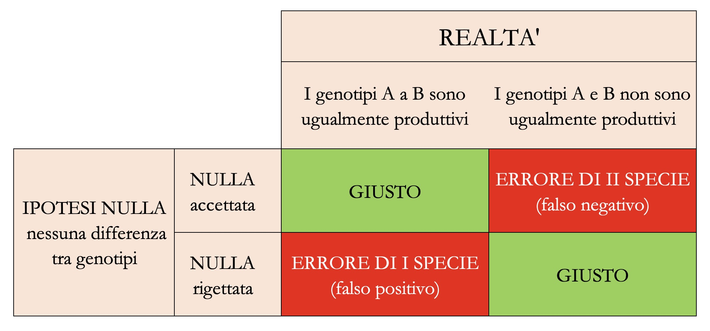

# Decisioni ed incertezza

Dovrebbero ormai essere chiari i motivi per cui i risultati di un esperimento non corrispondono alla verità vera e si presentano in modo diverso ogni volta che lo ripetiamo. Nel capitolo precedente abbiamo visto come è possibile (e necessario) esplicitare la nostra incertezza in relazione alla verità vera, aggiungendo alle nostre stime campionarie il cosiddetto **intervallo di confidenza**, basato sulla *sampling distribution* della stima, cioè l'ipotetica popolazione di stime ottenute ripetendo molte volte l'esperimento. Un approccio affine può essere utilizzato per prendere decisioni in presenza di incertezza, con un procedimento che si chiama **test d'ipotesi** ed è basato sul cosiddetto **P-level**. Anche per questo argomento, vediamo alcuni semplici, ma realistici, esempi.

## Esempio 7.1: Confronto tra due genotipi

Immaginiamo che un ricercatore abbia testato la produzione di due genotipi (A e P) in un disegno sperimentale a randomizzazione completa, con cinque repliche (dieci parcelle in totale). I risultati ottenuti (q/ha) sono i seguenti:

Come al solito, l'analisi dei dati inizia con il calcolo delle più importanti statistiche descrittive per ogni campione, come abbiamo visto nel Capitolo 3. Trattandosi di una serie di misure quantitative, calcoliamo quindi media e deviazione standard, come indicato nel box sottostante.

```{r}
# Riquadro 7.1

# Esempio 7.1
# Confronto tra due genotipi

# Caricamento dei dati
A <- c(65, 68, 69, 71, 78)
P <- c(80, 81, 84, 88, 94)

# Statistiche descrittive per A
m1 <- mean(A)
s1 <- sd(A)
n1 <- length(A)
m1; s1; n1

# Statistiche descrittive per P
m2 <- mean(P)
s2 <- sd(P)
n2 <- length(P)
m2; s2; n2
```

Vediamo che la media per il genotipo P è più alta della media per il genotipo A, ma tali medie campionarie non sono sufficienti per i nostri obiettivi. Il passo successivo è postulare un modello descrittivo per rappresentare il meccanismo tramite cui le nostre osservazioni (e altre osservazioni future) potrebbero essere originate. Tale modello dovrebbe tenere conto dell'effetto di una variabile predittiva, ovvero il genotipo. Un modello ragionevole è:

$$
Y_i = \mu + \delta_j + \varepsilon_{i}
$$

dove $Y_i$ è la resa dell'i^-esimo^ grafico ($i$ va da 1 a 10), $\mu$ è la resa prevista per il genotipo A, mentre $\delta_j$ è l'effetto del genotipo (con $j$ che va da 1 a 2) che è vincolato a essere 0 per il primo genotipo ($\delta_1 = 0$) e, per il secondo genotipo, è uguale alla differenza di resa tra i due genotipi ($\delta_2 = \mu_2 - \mu_1$). Di conseguenza, la resa prevista per P è $\mu_2 = \mu_1 + \delta_2$ e i residui $\varepsilon_i$ rappresentano tutte le altre fonti sconosciute di variabilità, che sono indipendenti e specifiche per ogni parcella. I residui sono assunti come gaussiani, con media uguale a 0 e deviazione standard uguale a $\sigma$. La scelta di usare $\delta_2$ (differenze tra la seconda varietà è la prima) come parametro esplicito nel modello è puramente arbitraria: avremmo potuto anche includere $\delta_1$ (differenze tra la prima varietà e la seconda) che sarebbe stata uguale a $\delta_2$ in valore assoluto, ma con segno invertito e avrebbe reso $\mu$ uguale alla media del secondo genotipo, invece che del primo.

La stima dei parametri del modello può essere eseguita utilizzando la funzione `lm()` in R, come mostrato nel Capitolo 4.


```{r}
# Riquadro 7.2

# Esempio 7.1 [segue]

# Adattamento di un modello ANOVA ad una via
# ai dati immessi nel Riquadro 7.1
yield <- c(A, P)
genotype <- rep(c("A", "P"), each = 5)
mod <- lm(yield ~ genotype)
summary(mod)

confint(mod)
```

È importante notare che la deviazione standard residua ($\sigma$), con una terminologia confusa, è indicata come 'errore standard residuo' ($\sigma = 5,315$) nell'output R. È anche importante notare che, in base al nostro modello, la deviazione standard dei residui è unica e comune a tutte le osservazioni e, pertanto, stiamo assumendo che l'effetto genotipo influenzi il livello di resa e non la sua variabilità tra le repliche. Tale ipotesi è chiamata **omoschedasticità** (od **omoscedasticità**) e dovrà essere accuratamente controllata, come mostreremo in uno dei capitoli seguenti.

Gli errori standard per tutte le stime puntuali sono già disponibili nell'output di R: la vera differenza tra i due genotipi, a livello di popolazione ($\delta_2$) è ignota e incerta, ma sulla base dei dati in nostro possesso, confidiamo che sia compresa tra 7.45 e 22.95. Il fatto che l'intervallo di confidenza per $\delta_2$ non contenga 0 è una prova indiretta che l'effetto del genotipo è significativo.


### L'ipotesi 'nulla'

Dopo aver completato l'inferenza statistica, ci chiediamo se, a livello di popolazione, sia possibile concludere che il genotipo P è più produttivo del genotipo A, coerentemente con i risultati osservati nei due campioni. Non dimentichiamoci che i due campioni sono totalmente irrilevanti, perché vogliamo trarre conclusioni generali e non specifiche per il nostro esperimento. Dobbiamo quindi **trovare un metodo per decidere se il genotipo P, in generale, è più produttivo del genotipo A**, pur in presenza dell'incertezza legata all'errore sperimentale.

Seguendo la logica Popperiana illustrata nel primo capitolo, è conveniente porre l'ipotesi scientifica di nostro interesse ($H_0$) in modo che essa possa essere falsificata, cioè, ad esempio:

$$H_0: \delta_2 = 0$$

In altre parole, stiamo cercando di dimostrare che uno dei parametri stimati nel modello sia, in realtà, uguale a 0; questa ipotesi si chiama **ipotesi nulla** e, se riuscissimo a falsificarla, avremmo conseguito il nostro obiettivo, in totale coerenza con la logica Popperiana.


### Il test di t (Wald test)

In practica, stiamo cercando di dimostrare che un parametro del modello è uguale a 0, quando, in realtà, la nostra stima puntuale è diversa da 0. È intuitivamente chiaro che un certo grado di discrepanza tra la realtà e l'osservazione è accettabile come caratteristica intrinseca del processo di campionamento, ma è anche chiaro che maggiore è la discrepanza, minore è la probabilità che l'ipotesi "nulla" sia vera. In particolare, la nostra intuizione è che un parametro è significativamente diverso da zero quando il suo valore è molto più grande dell'incertezza con cui lo abbiamo stimato.

Un statistica che risponde alla nostra esigenza è quella indicata di seguito:

$$T = \frac{d_2}{SE_{d_2}} = \frac{15.2}{3.362} = 4.521727$$

Se l'ipotesi nulla fosse vera, dovremmo osservare $T = 0$, mentre abbiamo osservato $T = 4.522$; quindi l'ipotesi nulla è falsa? Non è detto; è possible che, anche con l'ipotesi nulla vera, vi siano variazioni casuali legate al campionamento, che portino a valori di $T \neq 0$, ma che dovrebbero comunque divenire via via meno probabili, man mano che ci si allontana dallo zero. In altre parole, analogamente a quanto abbiamo fatto nel Capitolo precedente, dovremmo chiederci: **qual è la distribuzione campionaria per $T$ sotto l'ipotesi nulla?**

### Simulazione Monte Carlo


Per rispondere a questa domanda, supponiamo che l'ipotesi nulla sia vera. In questo caso, immaginiamo che le nostre dieci parcelle siano tutte estratte da una sola popolazione di parcelle con media e deviazione standard stimate (stima puntuale) come segue:

```{r}
# Riquadro 7.3

# Esempio 7.1 [segue]
# Immaginiamo di avere un solo gruppo, senza distinsioni di genotipo
# Calcoliamo le statistiche descrittive
mu <- mean(yield)
devStAP <- sd(c(A, P))
mu; devStAP
```

Prendiamo quindi questa popolazione normale, con $\mu = 77.8$ e $\sigma = 9.45$, ed utilizziamo un generatore di numeri casuali gaussiani per estrarre numerose (100'000) coppie di campioni, calcolando, per ogni coppia, il valore T, come abbiamo fatto con la nostra coppia iniziale. Il codice da utilizzare in R per le simulazioni è il seguente:

```{r eval = FALSE, echo = TRUE}
# Riquadro 7.4

# Esempio 7.1 [segue]

# Costruiamo una distribuzione campionaria per T
# assumendo che l'ipotesi nulla è vera

set.seed(34)
result <- rep(NA, 100000)
for (i in 1:100000){
  epsilon <- rnorm(10, 0, devStAP)
  Yo <- mu + epsilon
  mod <- lm(Yo ~ genotype)
  d2 <- coef(mod)[2]
  SE <- summary(mod)$coefficients[[2,2]]
  Ti <- d2 / SE
  result[i] <- Ti
}
mean(result) 
## 0.001230418

min(result)
## -9.988315

max(result)
## 9.993187
```

```{r include=FALSE}
load("_Support/simul1.rda")
```


```{r}
#| eval: false
#| include: false
mean(result) 
min(result)
max(result)
```

Quali valori abbiamo ottenuto per $T$? In media, i valori sono prossimi a 0, come previsto, considerando che abbiamo simulato i risultati di esperimenti in cui $\delta_2$ era assunto pari a 0. Tuttavia, notiamo anche valori piuttosto alti e bassi (vicini a 10 e -10), il che dimostra che le fluttuazioni del campionamento casuale possono anche portare a risultati molto "strani". Per il nostro esperimento reale abbiamo ottenuto $T = 4.522$, sebbene il segno positivo sia solo un artefatto, legato al modo in cui abbiamo formulato il nostro modello: avremmo potuto ottenere anche $T = -4.522$ se avessimo utilizzato $\mu_2$ come parametro esplicito, invece di $\mu_1$.

**Ronald Fisher ha proposto di rifiutare l'ipotesi nulla, in base alla probabilità di ottenere valori tanto 'estremi' o più 'estremi' di quello osservato, quando l'ipotesi nulla è vera**. Osservando il vettore "result", vediamo che la proporzione di valori inferiori a -4.521727 e superiori a 4.521727 è $0.00095 + 0.00082 = 0.00177$. Questo è il cosiddetto **P-Level** o **P-value** (vedere il codice sottostante).

\vspace{12pt}
```{r}
# Riquadro 7.5

# Esempio 7.1 [segue]
# Calcolo del P-value con una simulazione Monte Carlo
T_obs <- 4.521727
upperTail <- length(result[result > T_obs]) / 100000
lowerTail <- length(result[result < - T_obs]) /100000 
upperTail + lowerTail
```


Ora proviamo a riassumere. Abbiamo visto che, quando l'ipotesi nulla è vero, la distribuzione campionaria di $T$ contiene una percentuale molto bassa di valori al di fuori dell'intervallo da -4.522 a 4.522. Pertanto, la nostra osservazione rientra in un intervallo molto improbabile, che ha scarsissima probabilità di verificarsi (P-value = 0.0017); dato che la **soglia di rifiuto è P = 0.05**, coerentemente, rigettiamo l'ipotesi nulla e lo facciamo perché, se l'ipotesi nulla fosse vera, avremmo ottenuto un risultato molto improbabile; in altre parole, l'evidenza scientifica contro l'ipotesi nulla è sufficientemente forte da permetterci di rigettarla.

### Una soluzione formale

Calcolare il P-value poco sopra ha richiesto di costruire una *sampling distribution* empirica con una serie di simulazioni Monte Carlo, piuttosto 'costose' in termini di tempo di calcolo. Allora è opportuno chiedersi: esiste una Funzione di Densità di Probabilità (PDF) formale che possiamo utilizzare al posto *sampling distribution* empirica? Se prendiamo il vettore 'result' e lo 'discretizziamo', riportandolo in un istogramma (Fig. -@fig-figName71) possiamo vedere che la distribuzione empirica non è pienamente sovrapponibile con una gaussiana standardizzata, ma può essere meglio descritta con un altro tipo di distribuzione, ovvero la 't di Student', con otto gradi di libertà (cioè la somma dei gradi di libertà dei due campioni)^[La distribuzione t di Student fu ideata dallo 'studente' William Sealy Gosset (1876 - 1937), che utilizzava questo pseudonimo nei suoi articoli scientifici mentre lavorava alla Guinness Brewery di Dublino. E' simile a una distribuzione gaussiana standardizzata, ma con code più alte, cioè con una maggiore probabilità di ottenere outliers, sia positivi, che negativi. L'altezza delle code è inversamente proporzionale al parametro $\nu$ (il numero di DF), in modo che questa distribuzione tende ad una gaussiana quando $\nu$ tende ad infinito].


```{r fig-figName71, echo= F, fig.align='center', fig.cap="Empirical sampling distribution for the T statistic, compared to a standardised gaussian (blue line) and a Student's t distribution with 8 degrees of freedom (red line). The observed T-values have been highlighted and the total probability (area-under-the-curve) of sampling outside the interval from -4.522 to 4.522 represents the P-value", out.width="85%"}

# # Sampling distribution per T 
# b <- seq(-10, 10, by=0.25)
# hist(result, breaks = b, freq=F, 
#   xlab = expression(paste(m)), ylab="Density", 
#   xlim=c(-6,6), ylim=c(0,0.45), main="")
# curve(dnorm(x), add=TRUE, col="blue", n = 10001)
# curve(dt(x, 8), add=TRUE, col="red", n = 10001)
# arrows(4.522, 0.1, 4.522, 0)
# arrows(-4.522, 0.1, -4.522, 0)
# text(4.522, 0.12, label = "4.522", cex = 1.6)
# text(-4.522, 0.12, label = "-4.522", cex = 1.6)
# Graph with ggplot
library(ggplot2)
load("_Support/simul1.rda")
dframe <- data.frame(result)
dtext <- data.frame(x = c(-4.52, 4.52), y = c(0.12, 0.12))
# max(result)
# min(result)
b <- seq(-10, 10, by=0.25)
ggplot(dframe) +
  geom_histogram(mapping = aes(x = result, 
                               y = after_stat(density)),
                 colour = "black",
                 fill = "lightgrey",
                 orientation = "x",
                 breaks = b) +
  geom_function(fun = function(x) dnorm(x), colour = "blue") +
  geom_function(fun = function(x) dt(x, 8), colour = "red") +
  geom_label(data = dtext, mapping = aes(x=x, y=y, label=x)) +
  geom_segment(data = data.frame(), aes(x = -4.5, y = 0.11, xend = -4.5, yend = 0.01),
     arrow = arrow(length = unit(0.0, "cm"), type = "closed") ) +
  geom_segment(data = data.frame(), aes(x = 4.5, y = 0.11, xend = 4.5, yend = 0.01),
     arrow = arrow(length = unit(0.0, "cm"), type = "closed") ) +
  geom_segment(data = data.frame(), aes(x = -4.5, y = 0.025, xend = -6, yend = 0.025),
     arrow = arrow(length = unit(0.2, "cm"), type = "closed") ) +
  geom_segment(data = data.frame(), aes(x = 4.5, y = 0.025, xend = 6, yend = 0.025),
     arrow = arrow(length = unit(0.2, "cm"), type = "closed") ) +
  scale_x_continuous(name = "m", limits = c(-6, 6)) +
  scale_y_continuous(name = "Densità", limits = c(0, 0.4)) +
  theme_bw()
```

Di conseguenza, possiamo utilizzare la distribuzione t di Student per calcolare il *P-value*, come mostrato nel riquadro sottostante. Invece che sommare le probabilità di ottenere valori superiori a 4.522 e inferiori a -4.522, possiamo anche moltiplicare per due la probabilità di ottenere valori superiori al valore assoluto del T osservato, dato che la distribuzione di t di Student è simmetrica. Il livello di probabilità ottenuto formalmente (Riquadro 7.6) è simile a quello ottenuto empiricamente, ma, rispetto a quest'ultimo, è più preciso, in quanto con la simulazione di Monte Carlo non abbiamo potuto considerare, come avremmo dovuto, un numero infinito di repliche dell'esperimento.

\vspace{12pt}
```{r}
# Riquadro 7.6

# Esempio 7.1 [segue}

# Calcolo del P-value con la distribuzione t di Student
pt(T_obs, df=8, lower.tail = FALSE) # probability that T > 4.522
pt(-T_obs, df=8) # probability that T < -4.522
2 * pt(abs(T_obs), df=8, lower.tail = F) # P-value
```


Per concludere questa sezione, dobbiamo precisare che **l'impiego di una *sampling distribution* formale richiede che siano verificate due condizioni di base**^[In realtà le assunzioni di base sono più di due, ma le considereremo in maggior dettaglio nel Capitolo 8]:

1. i residui sono campionati da una distribuzione normale (normalità);
2. la deviazione standard è unica e non è influenzata dal trattamento sperimentale (omoschedasticità).

Avrete infatti notato che queste due condizioni erano 'incapsulate' nella simulazione Monte Carlo che abbiamo eseguito in precedenza per ottenere la *sampling distribution* empirica di T. Se le due ipotesi non fossero rispettate, la distribuzione t di Student non rappresenterebbe esattamente la *sampling distribution* della statistica T e, di conseguenza, il P-level non sarebbe valido. Più avanti in questo libro vedremo come è possibile verificare che le due assunzioni di base siano effettivamente rispettate.

### Il test t di Student tradizionale

Il test t che abbiamo appena mostrato è utilizzato come supporto alle procedure di *model fitting* (Wald test) e permette di verificare l'ipotesi che uno dei parametri stimati sia significativamente diverso da 0. Il test t di Student propriamente detto è invece una tecnica tradizionale di analisi dei dati (risale al 1908) per il confronto tra due medie campionarie, senza alcun legame col *model fitting*. Sebbene, al giorno d'oggi il test t di Student debba essere considerato un po' obsoleto, è comunque opportuno conoscere come questa procedura possa essere eseguita in R, con la funzione `t.test()`. Il box sottostante mostra che i risultati che si ottengono sono identici a quelli ottenuti nella sezione precedente.

\vspace{12pt}
```{r}
# Riquadro 7.7

# Esempio 7.1 [segue]
# Il test di t tradizionale con R
t.test(A, P, var.equal = TRUE)
```

Anche il test di t di Student tradizionale richiede l'omoschedasticità dei residui, che viene specificata mediante l'argomento `var.equal = TRUE`. E'possibile estendere l'impiego della funzione `t.test()` alle situazioni in cui i due campioni hanno varianze diverse, modificando il codice con l'argomento `var.equal = FALSE`. In questo modo viene eseguito il test di t eteroschedastico, noto anche come test di Welch, che, grazie alla sua maggiore robustezza è spesso preferito al test t di Student tradizionale, tanto da essere considerato l'opzione predefinita in R.

\vspace{12pt}
```{r}
# Riquadro 7.8

# Esempio 7.1 [segue]
# Test di t eteroschedastico (Welch test) con R

t.test(A, P, var.equal = F)
```

## Esempio 7.2: Misure appaiate

In alcuni casi, l'esperimento prevede due misure sullo stesso soggetto ed è finalizzato a verificare se esiste una differenza significativa tra la prima e la seconda misura. Ad esempio, immaginiamo di aver esaminato un campione di venti topi pesandoli all'inizio e alla fine di un certo programma alimentare, in modo da avere due misurazioni appaiate, per un totale di quaranta valori. Il test t di Student assume che le misure siano completamente indipendenti, cosa che non si verifica in questo caso, dove abbiamo quaranta dati ma solo venti soggetti.

Quando le misure sono appaiate, dobbiamo necessariamente eseguire un test di t appaiato, impostando l'argomento `paired = TRUE`, come mostrato nel riquadro sottostante. Si noti che, anche se abbiamo 40 valori, il numero di gradi di libertà è 19, pari al numero di soggetti indipendenti meno uno.

```{r eval=FALSE, include=FALSE}
# Riquadro 7.9

# Esempio 7.2
# Misure appiate per confrontare due programmi alimentari
# Nei due vettori, le misure in posizioni corrispondenti sono prese nello stesso animale

before <- c(171.8, 228.3, 181.5, 182.2, 162.3, 194.1, 193.3, 
            187.6, 197.2, 207.1, 184.8, 175.3, 184.8, 199.4,
            196.3, 186.2, 221.1, 205.5, 208.5, 193.7)
after <- c(400.2, 452.7, 423.4, 384.8, 363.5, 385.8, 387.8,
           397.5, 397.9, 404.3, 413.5, 454.6, 377.7, 362.2, 
           382.7, 379.4, 401.7, 379.6, 417.1, 364.1)
t.test(before, after, paired = T, var.equal = F)
```


## Esempio 7.3: saggiare le differenze tra parametri

Il test di Welch può essere generalizzato a qualunque situazione in cui abbiamo due stime indipendenti e vogliamo valutare se la loro differenza è significativa. Ad esempio, immaginiamo di aver stimato il tasso di crescita della barbabietola da zucchero con due diverse pratiche agronomiche e di aver ottenuto le stime $\rho_1 = 0.22$ con un errore standard di 0.013 e $\rho_2 = 0.31$ con un errore standard di 0.029. Il valore di T può essere ottenuto come:

$$T = \frac{0.31 - 0.22}{\sqrt{0.031^2 + 0.029^2}} = -2.12$$

Se la dimensione del campione è sufficientemente ampia e le due stime provengono da un ugual numero di soggetti, potremmo utilizzare un'approssimazione gaussiana per ottenere il P-value, come mostrato nel box sottostante.


```{r}
# Code box 7.10

# Example 7.3
# testing differences between model parameters

T_obs <- (0.22 - 0.31)/sqrt(0.031^2 + 0.029^2)
2 * pnorm(abs(T_obs), lower.tail = F)
```


## Esempio 7.4: il test F nell'ANOVA

Il rapporto F è una misura della forza di una relazione causale tra un insieme di predittori nominali/quantitativi e una risposta quantitativa (vedi Capitoli 3 e 4). Ogni volta che i dati osservati rappresentano un campione di una popolazione più ampia, il valore F osservato è solo una stima di un numero infinito di possibili valori F, che definiscono una distribuzione campionaria. Che forma ha questa distribuzione campionaria?

Ad esempio, se riconsideriamo l'esperimento di confronto varietale nell'Esempio 4.3 (dati 'oat1L'), il test F per il genotipo (Riquadro 4.7) mostra un valore di 42.71, con 3 gradi di libertà al numeratore e 8 gradi di libertà al denominatore.

```{r eval=FALSE, include=FALSE}
# Not to be shown, it is already at Code box 4.7
dataset <- statforbiology::getAgroData("oat1L")
mod <- lm(Yield ~ Genotype, data = dataset)
anova(mod)
```

Per questo esperimento, l'ipotesi nulla corrisponderebbe a una situazione in cui, a livello di popolazione, è:

$$H_0: \mu_1 = \mu_2 = \mu_3 = \mu_4$$

Ciò equivale a dire che tutti gli effetti dei trattamenti sono uguali a 0:

$$H_0: \alpha_1 = \alpha_2 = \alpha_3 = \alpha_4 = 0$$

Il rapporto F osservato sembra contraddire l'ipotesi nulla, ma potrebbe trattarsi di un valore inaspettatamente alto capitato per caso, senza che vi sia una reale differenza tra i genotipi. Dobbiamo chiederci: qual è la distribuzione campionaria del rapporto F quando l'ipotesi nulla è vera?

Anche in questo caso potremmo costruire una distribuzione campionaria empirica, utilizzando il metodo Monte Carlo, ma è più comodo impiegare una funzione di densità formale. Il matematico americano George Snedecor ha dimostrato che quando l'ipotesi nulla è vera ed i residui sono indipendenti, distribuiti normalmente ed omoschedastici, la distribuzione campionaria per il rapporto F può essere descritta con la cosiddetta distribuzione F di Fisher (o meglio, Fisher-Snedecor), che è definita solo per valori positivi, è asimmetrica (right-skewed) e dipende del numero di gradi di libertà al numeratore e al denominatore. Un esempio è mostrato in Figura -@fig-figNameF.

```{r fig-figNameF, echo = F, out.width='75%', fig.align ='center', fig.cap="Funzione di densità di Fisher-Snedecor, con 3 ed 8 gradi di libertà. Se consideriamo un ipotetico F osservato pari a 3, la probabilità totale nella coda destra (AUC: Area-Under-the-Curve) rappresenta il  P-value, che, in questo caso, è pari a 0.095"}
# Graph with ggplot
ggplot(data.frame(x = 0)) +
  geom_function(fun = function(x) df(x, 3, 8), colour = "black") +
  scale_x_continuous(name = "Valore F", limits = c(0, 6)) +
  scale_y_continuous(name = "Densità", limits = c(0, 0.7)) +
  geom_segment(data = data.frame(),
               mapping = aes(x = 3, y = 0.2,
                             xend = 3, yend = 0.07),
     arrow = arrow(length = unit(0.0, "cm"), type = "closed") ) +
  geom_segment(data = data.frame(),
               mapping = aes(x = 3, y = 0.08, xend = 6,
                             yend = 0.08),
     arrow = arrow(length = unit(0.25, "cm"), type = "closed") ) +
  geom_area(stat = "function",
            fun = function(x) df(x, 3, 8),
            # args = list(df1 = 3, df2 = 8),
            fill = "red", xlim = c(3, 6),
            alpha = .50) +
  geom_label(mapping = aes(x = 3, y = 0.2, label = 3)) +
  theme_bw()
```

In R, il P-value si può calcolare con la funzione `pf()`, passando, nell'ordine, il valore osservato, i gradi di libertà del numeratore e del denominatore, oltre alla specifica relativa al fatto che vogliamo la coda destra della distribuzione (`pf(42.707, 3, 8, lower.tail = F) = 2.866138e-05`). Il P-value è inferiore a 0,05 e, di conseguenza, possiamo rifiutare l'ipotesi nulla: i genotipi non sono tutti uguali.

## Conclusioni

Concludiamo ribadendo che l'incertezza intrinseca nei dati sperimentali non consente di trarre conclusioni senza rischio di errore. Poiché il nostro obiettivo è quello di rifiutare l'ipotesi nulla, dobbiamo proteggerci dal rischio di un rifiuto erroneo, che ci porterebbe a concludere che il trattamento è 'efficace' quando in realtà ciò non è vero (falso positivo). La protezione dall'errore di falso positivo si mette in atto con la seguente procedura:

1. calcolare una statistica utile (statistica pivotale) per riassumere i risultati di un esperimento (come il valore T o il rapporto F);
2. identificare una distribuzione campionaria per esprimere la variabilità della statistica oggetto di studio, quando l'ipotesi nulla è vera e si ripete l'esperimento con lo stesso disegno sperimentale, ma un diverso campione di soggetti. La distribuzione campionaria può essere una funzione di probabilità teorica od empirica, ottenuta con il metodo Monte Carlo;
3. utilizzare la distribuzione campionaria selezionata per derivare la probabilità di eventi altrettanto estremi o più estremi di quello osservato nello specifico esperimento in studio;
4. rigettare l'ipotesi nulla se la probabilità calcolata al punto 3 è inferiore a 0.05.

Prima di concludere, vorremmo sottolineare tre questioni fondamentali, che dovremmo sempre tenere a mente:


1. Il P-value è considerato come la probabilità di rifiutare erroneamente l'ipotesi nulla (errore di I specie o di falso positivo). Tuttavia, tale probabilità va interpretata con riferimento alla distribuzione campionaria, non in relazione al singolo esperimento oggetto di studio. Insomma, quando riusciamo a rigettare l'ipotesi nulla, siamo in grado di concludere che: *se l'ipotesi nulla fosse vera e ripetessimo l'esperimento un numero infinito di volte, avremmo meno del 5% di probabilità di ottenere un valore T o F altrettanto elevato o più elevato (in valore assoluto) di quello da noi osservato*. Quindi avere una probabilità d'errore del 5% significa che, adottando una procedura formale di test d'ipotesi, su 100 esperimenti in cui l'ipotesi nulla è vera, solo in cinque di essi l'ipotesi nulla verrebbe rigettata errorneamente. Al contrario, non possiamo concludere che la nostra specifica conclusione di rigettare l'ipotesi nulla abbia *meno del 5% di probabilità di essere  errata*, perchè non abbiamo nessun elemento per stabilire se l'ipotesi nulla è vera o falsa nel nostro caso.
2. Il P-value è calcolato a partire da una certa sampling distribution teorica, individuata assumendo che i residui siano normali ed omoschedastici. Se queste assunzioni di base non sono soddisfatte, il P-value è invalido. In uno dei prossimi capitoli mostreremo come verificare che gli assunti di base siano rispettati.
3. Oltre all'ipotesi nulla, Neyman e Pearson hanno proposto di adottare un'ipotesi alternativa che si considera vera quando l'ipotesi nulla viene rifiutata. Ad esempio (vedi Sezione 7.1), se l'ipotesi nulla è $H_0: \delta_2 = 0$, l'alternativa è $H_1: \delta_2 \neq 0$. Sono possibili anche ipotesi alternative più complesse, come $H_1: \delta_2 > 0$ o $H1: \delta_2 < 0$, sebbene queste ipotesi alternative complesse possano essere adottate solo quando vi è una qualche conoscenza a priori che le giustifichi. Ciò è necessario in quanto un test d'ipotesi con un'ipotesi alternativa complessa (test ad una coda) è più potente di un test a due code. In ogni caso, dovremmo evitare il comune equivoco secondo cui rifiutare l'ipotesi nulla implichi che l'alternativa sia dimostrata o che l'alternativa sia vera con una probabilità $P_{alt} = 1 - \textrm{P-value}$ [@gigerenzer_2018].
4. Quando prendiamo una decisione "statistica", non corriamo solo il rischio di commettere un errore di falso positivo (errore di tipo I), ma corriamo anche il rischio di commettere un errore di falso negativo (errore di tipo II), se non rifiutiamo un'ipotesi falsa nulla. Questi due tipi di errore sono rappresentati nella Figura -@fig-figName72; essi sono strettamente collegati nel senso che maggiore è la protezione contro l'errore falso positivo, maggiore è il rischio di commettere un errore falso negativo. In generale, dovremmo sempre essere attenti a decidere quale dei due errori potrebbe essere più pericoloso per il nostro obiettivo specifico.

```{r fig-figName72, echo=FALSE, fig.align='center', fig.cap="I due tipi di errori statistici", out.width="85%"}

```


## Esercizi

1. La nostra miglior stima puntuale del parametro $\gamma$ di un modello statistico è $g = -7.2$, con un errore standard pari a 2.8, con 16 gradi di libertà. E'possibile che, in realtà, sia $\gamma = 0$? Qual è il P-level per l'ipotesi nulla? Devo accettarla o posso rifiutarla?
2. La nostra miglior stima puntuale del parametro $\delta$ di un modello statistico è $d = 13.5$, con un errore standard pari a 8.4, ma non è disponibile, per questo errore standard, una stima accurata dei gradi di libertà. E'possibile che, in realtà, sia $\delta = 0$? Qual è il P-level per l'ipotesi nulla? Devo accettarla o posso rifiutarla?
3. Uno sperimentatore ha impostato un esperimento per confrontare due tesi sperimentali (A, B). I risultati sono i seguenti (in t/ha) `A <- c(9.3, 10.2, 9.7)` e `B <- c(12.6, 12.3, 12.5)`. Stabilire se i risultati per le due tesi sperimentali possono essere considerati significativamente diversi, per un livello di probabilità di errore di I specie del 5%.
4. Uno sperimentatore ha impostato un esperimento per confrontare se l'effetto di un fungicida è significativo, in un disegno sperimentale con tre ripetizioni. Con ognuna delle due opzioni di trattamento i livelli di infestazione (in percentuale) sono: `A <- c(6.5, 7.1, 6.8)` e `NT <- c(54.1, 48.2, 63.1)`. E'significativo l'effetto del trattamento fungicida, per un livello di probabilità del 5%? SUGGERIMENTO: prestare attenzione all'omogeneità delle varianze.
5. Con un esperimento in laboratorio, abbiamo stimato che il tasso di degradazione di una sostanza xenobiotica in acqua è $k_1 = -0.071 \pm 0.012$ (7 gradi di libertà). Per una sostanza affine il tasso di degradazione è pari a $k_2 = -0.153 \pm 0.024$ (7 gradi di lbertà); possiamo concludere che il tasso di degradazione delle due sostanze, in realtà, non è significativamente diverso?
6. In un ospedale, è stata misurata la concentrazione di colesterolo nel sangue di otto pazienti, prima e dopo un trattamento medico. Per ogni paziente, sono stati analizzati due campioni, ottenendo le seguenti concentrazioni (in ordine di paziente): `Prima <- c(167.3, 186.7, 107.0, 214.5, 149.5, 171.5, 161.5, 243.6)` e `Dopo <- c(166.7, 184.2, 104.9, 205.3, 148.5, 157.3, 149.4, 241.5)`. Si può concludere che il trattamento medico è stato efficace?
7. Un veterinario ha organizzato un esperimento per valutare l'effetto di una dieta innovativa, sulla pressione arteriosa sistolica di cavalli da corsa. Le informazioni preliminari mostrano con chiarezza che questa dieta innovativa non può avere effetti negativi, ma, eventualmente, solo positivi. Il ricercatore ha selezionato a caso 16 animali, ne ha misurato la pressione arteriosa a riposo ed ha ripetuto la stessa misurazione dopo sei mesi di questa dieta. I risultati ottenuti sono i seguenti: I risultati ottenuti sono: `prima <- c(113.5, 116.5, 118.1, 111.3, 116.8, 117.0, 114.8, 114.9, 114.8, 114.2, 115.0, 114.0, 114.4, 116.1, 117.9, 115.7)` e `dopo <- c(110.9, 110.1, 110.3, 116.8, 112.2, 111.0, 111.1, 112.9, 110.6, 109.1, 113.1, 109.9, 111.9, 110.1, 114.2, 111.0)`. Stabilire se la dieta è efficace, con una probabilità di errore P < 0.05. SUGGERIMENTO: ricordare che la l'effetto atteso della dieta, per le informazioni preliminari disponibili, può, eventualmente, essere solo quello di abbassare la pressione, mai quello di alzarla.
8. I Q.I. di 16 studenti provenienti da un quartiere di una certa città sono risultati pari a: `QI1 <- c(90.31, 112.63, 101.93, 121.47, 111.37, 100.37, 106.80, 101.57, 113.25, 120.76,  88.58, 107.53, 102.62, 104.26, 95.06, 104.88)`. Gli studenti provenienti da un altro quartiere della stessa città hanno invece mostrato i seguenti Q.I.: `QI2 <- c(90.66, 101.41, 104.61,  91.77, 107.06,  89.51,  87.91, 92.31, 112.96,  90.33,  99.86,  88.99,  98.97,  97.92)`. Esiste una differenza significativa tra i Q.I. nei due quartieri della città?
9. Viene estratto un campione di rondelle da una macchina in perfette condizioni di funzionamento. Lo spessore delle rondelle misurate è: `S1 <- c(0.0451, 0.0511, 0.0478, 0.0477, 0.0458, 0.0509, 0.0446, 0.0516, 0.0458, 0.0490)`. Dopo alcuni giorni, per determinare se la macchina sia ancora a punto, viene estratto un altro campione di 10 rondelle, il cui spessore medio risulta: `S2 <- c(0.0502, 0.0528, 0.0492, 0.0556, 0.0501, 0.0500, 0.0498, 0.0526, 0.0517, 0.0550)`. Verificare se la macchina sia ancora ben tarata, oppure necessiti di revisione.
10. Le varianze di due campioni composti da 30 unità sono risultate pari, rispettivamente a 115.3 e 356.4; stabilire se il secondo campione ha una varianza significativamente più alta del primo. SUGGERIMENTO: considerare che il rapporto tra due varianze di campioni estratti dalla stessa popolazione gaussiana segue la distribuzione F di Fisher. Considerare anche che, in R, la funzione `pf(x, n1, n2, lower.tail = F)` restituisce la probabilità di ottenere valori pari o superiori ad $x$, da una distribuzione $F$ di Fisher con $n1$ ed $n2$ gradi di libertà. Considerare anche che il rapporto di due varianze può solo essere positivo.
11. Un agronomo ha organizzato un esperimento varietale, per confrontare tre varietà di frumento, cioè GUERCINO, ARNOVA e BOLOGNA. Per far questo ha individuato, in un campo uniforme dell'areale umbro, trenta parcelle da 18 m^2^ e ne ha selezionate dieci a caso, da coltivare con GUERCINO, altre dieci a caso sono state coltivate con ARNOVA e le ultime dieci sono state coltivate con BOLOGNA. Al termine dell'esperimento, le produttività osservate erano le seguenti: `guercino <- c(53.2, 59.1, 62.3, 48.6, 59.7, 60, 55.7, 55.8, 55.7, 54.4)`, `arnova <- c(53.1, 51, 51.9, 55.3, 58.8, 54.6, 53, 51.4, 51.7, 64.7)` e `bologna <- c(43.5, 41, 41.2, 44.8, 40.2, 37.2, 45.3, 38.9, 42.9, 39.3)`. Descrivere i tre campioni, utilizzando opportunamente un indicatore di tendenza centrale ed un indicatore di variabilità. Inferire le medie delle tre popolazioni (cioè quelle che hanno generato i tre campioni), utilizzando opportunamente un intervallo di incertezza. Per ognuna delle tre coppie (guercino vs arnova, guercino vs bologna, arnova vs bologna), valutare la differenza tra le medie e il suo errore standard. Valutare la significatività della differenza tra le medie delle tre popolazioni, esplicitando l'ipotesi nulla e calcolando il livello di probabilità di errore nel rifiuto dell'ipotesi nulla.

```{r eval=FALSE, include=FALSE}
# Esercizio 1
2 * pt(abs(-7.2/2.8), 16, lower.tail = F)

# Esercizio 2
2 * pnorm(abs(13.5/8.4), lower.tail = F)

# Esercizio 3
A <- c(9.3, 10.2, 9.7)
B <- c(12.6, 12.3, 12.5)
sd(A)
sd(B)
t.test(A, B, var.equal = T)

# Esercizio 4
A <- c(6.5, 7.1, 6.8)
NT <- c(54.1, 48.2, 63.1)
sd(A)
sd(NT)
t.test(A, NT, var.equal = F)

# Esercizio 5
diff <- -0.071 + 0.153
sed <- sqrt(0.012^2 + 0.024^2)
2 * pt(abs(diff/sed), 14, lower.tail = F)

# Esercizio 6
Prima <- c(167.3, 186.7, 107.0, 214.5, 149.5, 171.5, 161.5, 243.6)
Dopo <- c(166.7, 184.2, 104.9, 205.3, 148.5, 157.3, 149.4, 241.5)
sd(Prima)
sd(Dopo)
t.test(Prima, Dopo, paired = T, var.equal = T)

# Esercizio 7
prima <- c(113.5, 116.5, 118.1, 111.3, 116.8, 117.0, 114.8, 114.9, 
           114.8, 114.2, 115.0, 114.0, 114.4, 116.1, 117.9, 115.7)
dopo <- c(110.9, 110.1, 110.3, 116.8, 112.2, 111.0, 111.1, 112.9, 
          110.6, 109.1, 113.1, 109.9, 111.9, 110.1, 114.2, 111.0)
t.test(prima, dopo, paired = T, alternative = "greater")

# Esercizio 8
QI1 <- c(90.31, 112.63, 101.93, 121.47, 111.37, 100.37, 106.80, 101.57, 113.25, 120.76,  88.58, 107.53, 102.62, 104.26, 95.06, 104.88)
QI2 <- c(90.66, 101.41, 104.61,  91.77, 107.06,  89.51,  87.91, 92.31, 112.96,  90.33,  99.86,  88.99,  98.97,  97.92)
sd(QI1)
sd(QI2)
t.test(QI1, QI2, var.equal = T)

# Esercizio 9
S1 <- c(0.0451, 0.0511, 0.0478, 0.0477, 0.0458, 0.0509, 0.0446,
        0.0516, 0.0458, 0.0490)
S2 <- c(0.0502, 0.0528, 0.0492, 0.0556, 0.0501, 0.0500, 0.0498,
        0.0526, 0.0517, 0.0550)
sd(S1)
sd(S2)
t.test(S1, S2, var.equal = T)

# Esercizio 10
pf(356.4/115.3, 29, 29, lower.tail = F)

# Esercizio 11
t.test(arnova, bologna, var.equal = T)
t.test(guercino, bologna, var.equal = T)
t.test(arnova, guercino, var.equal = T)
```


